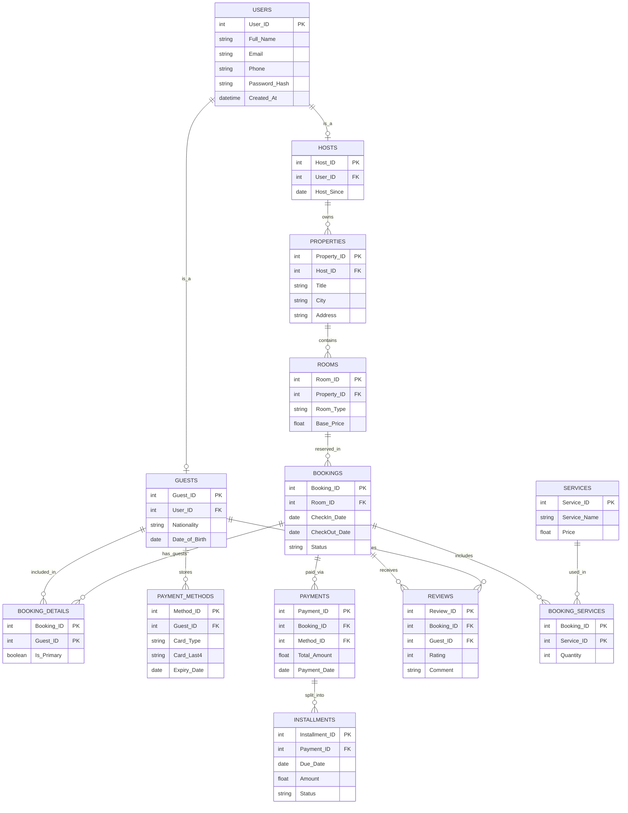

# CSE 204 - Introduction to Database Systems
## Project: Hotel Management System – Final Report

**Group Member 1:** Yasin Taha İnal (20230808021)  
**Group Member 2:** \_\_\_\_\_\_\_\_\_\_\_\_\_\_\_\_\_\_\_\_\_\_\_\_\_\_\_  
**Group Member 3:** \_\_\_\_\_\_\_\_\_\_\_\_\_\_\_\_\_\_\_\_\_\_\_\_\_\_\_  
**Group Member 4:** \_\_\_\_\_\_\_\_\_\_\_\_\_\_\_\_\_\_\_\_\_\_\_\_\_\_\_  
**Group Member 5:** \_\_\_\_\_\_\_\_\_\_\_\_\_\_\_\_\_\_\_\_\_\_\_\_\_\_\_  
**Group Member 6:** \_\_\_\_\_\_\_\_\_\_\_\_\_\_\_\_\_\_\_\_\_\_\_\_\_\_\_  

<br><br>

**Date:** 9 April 2026

---

# 1. Unnormalized Dataset (UNF)

The UNF table represents all data in a single flat (denormalized) form. Each row describes one service line within a booking, including all repeated guest, host, property, room, payment, and review details.

### Attribute List
1. `Guest_User_ID`, 2. `Guest_Full_Name`, 3. `Guest_Email`, 4. `Guest_Phone`, 5. `Guest_Nationality`, 6. `Guest_DOB`,
7. `Host_User_ID`, 8. `Host_Full_Name`, 9. `Host_Email`, 10. `Host_Since`,
11. `Property_ID`, 12. `Property_Title`, 13. `Property_City`, 14. `Property_Address`,
15. `Room_ID`, 16. `Room_Type`, 17. `Base_Price`,
18. `Booking_ID`, 19. `CheckIn_Date`, 20. `CheckOut_Date`, 21. `Booking_Status`, 22. `Is_Primary`,
23. `Method_ID`, 24. `Card_Type`, 25. `Card_Last4`, 26. `Expiry_Date`,
27. `Payment_ID`, 28. `Total_Amount`, 29. `Payment_Date`,
30. `Installment_ID`, 31. `Due_Date`, 32. `Installment_Amount`, 33. `Installment_Status`,
34. `Service_ID`, 35. `Service_Name`, 36. `Service_Price`, 37. `Quantity`,
38. `Review_ID`, 39. `Rating`, 40. `Comment`.

### Raw Data Example (UNF Table)
*In the raw UNF, all 40 attributes appear on every row. Host and property data repeat across bookings — this redundancy is what normalization resolves. The table below shows a representative subset of columns for readability.*

| Booking_ID | Guest_Name | Host_Name | Property | Room | CheckIn | CheckOut | Is_Primary | Card_Type | Total_Amt | Service | Qty | Rating |
| :--- | :--- | :--- | :--- | :--- | :--- | :--- | :--- | :--- | :--- | :--- | :--- | :--- |
| 101 | Mehmet Demir | Ahmet Yılmaz | Grand Plaza | Single | 2026-03-20 | 2026-03-22 | Yes | Visa | 250.00 | Breakfast | 1 | 5 |
| 102 | Elif Şahin | Ahmet Yılmaz | Grand Plaza | Double | 2026-03-21 | 2026-03-25 | Yes | Mastercard | 600.00 | Spa | 2 | 4 |
| 103 | Murat Aras | Caner Öz | Seaside Resort | Suite | 2026-04-10 | 2026-04-17 | Yes | Amex | 2100.00 | Airport Transfer | 1 | 5 |
| 103 | Selin Aras | Caner Öz | Seaside Resort | Suite | 2026-04-10 | 2026-04-17 | No | Amex | 2100.00 | Airport Transfer | 1 | 5 |
| 104 | Zeynep Yıldız | Caner Öz | Seaside Resort | Double | 2026-04-12 | 2026-04-15 | Yes | Visa | 600.00 | Breakfast | 1 | 3 |

> Row 3 and Row 4 show the same booking (Booking_ID 103) with two guests (primary + secondary), demonstrating the multi-guest feature. All host/property/room data repeats — this is the core redundancy that 3NF eliminates.

---

# 2. Entity-Relationship (E-R) Diagram (3NF)

### Normalization Process
1. **1NF:** Atomic data structure, elimination of repeating groups.
2. **2NF:** Removal of partial dependencies.
3. **3NF:** Resolution of transitive dependencies using junction/bridge tables.

### E-R Diagram (Mermaid.js)



---

# 3. SQL Queries (DDL and DML)

### Step 1 – Create the UNF Table

```sql
-- Each row is one service line within a booking.
-- Guest, host, property, room, payment and review data repeat across rows.
CREATE TABLE unf (
    Guest_User_ID        INT           NOT NULL,
    Guest_Full_Name      VARCHAR(100),
    Guest_Email          VARCHAR(100),
    Guest_Phone          VARCHAR(20),
    Guest_Nationality    VARCHAR(50),
    Guest_DOB            DATE,
    Host_User_ID         INT,
    Host_Full_Name       VARCHAR(100),
    Host_Email           VARCHAR(100),
    Host_Since           DATE,
    Property_ID          INT,
    Property_Title       VARCHAR(100),
    Property_City        VARCHAR(50),
    Property_Address     TEXT,
    Room_ID              INT,
    Room_Type            VARCHAR(50),
    Base_Price           DECIMAL(10,2),
    Booking_ID           INT           NOT NULL,
    CheckIn_Date         DATE,
    CheckOut_Date        DATE,
    Booking_Status       VARCHAR(20),
    Is_Primary           BOOLEAN,
    Method_ID            INT,
    Card_Type            VARCHAR(20),
    Card_Last4           CHAR(4),
    Expiry_Date          DATE,
    Payment_ID           INT,
    Total_Amount         DECIMAL(10,2),
    Payment_Date         DATE,
    Installment_ID       INT,
    Due_Date             DATE,
    Installment_Amount   DECIMAL(10,2),
    Installment_Status   VARCHAR(20),
    Service_ID           INT           NOT NULL,
    Service_Name         VARCHAR(100),
    Service_Price        DECIMAL(10,2),
    Quantity             INT,
    Review_ID            INT,
    Rating               INT,
    Comment              TEXT,
    PRIMARY KEY (Booking_ID, Guest_User_ID, Service_ID)
) DEFAULT CHARACTER SET utf8 COLLATE utf8_general_ci;
```

### Step 2 – Insert Sample Data

```sql
-- Booking 101: Mehmet Demir (primary) stays at Grand Plaza (owned by Ahmet Yılmaz)
INSERT INTO unf VALUES
(2,'Mehmet Demir','mehmet@mail.com','555-2002','Turkish','1990-06-01',
 1,'Ahmet Yılmaz','ahmet@mail.com','2024-01-10',
 1,'Grand Plaza','Istanbul','Besiktas Mah.',
 1,'Single',100.00,
 101,'2026-03-20','2026-03-22','Confirmed',TRUE,
 1,'Visa','1234','2028-06-01',
 201,250.00,'2026-03-20',
 301,'2026-04-20',125.00,'Pending',
 1,'Breakfast',20.00,1,
 401,5,'Great stay!');

-- Booking 102: Elif Şahin (primary) stays at Grand Plaza
INSERT INTO unf VALUES
(3,'Elif Şahin','elif@mail.com','555-3003','German','1988-09-12',
 1,'Ahmet Yılmaz','ahmet@mail.com','2024-01-10',
 1,'Grand Plaza','Istanbul','Besiktas Mah.',
 2,'Double',150.00,
 102,'2026-03-21','2026-03-25','Confirmed',TRUE,
 2,'Mastercard','5678','2027-12-01',
 202,600.00,'2026-03-21',
 302,'2026-04-21',300.00,'Pending',
 2,'Spa',50.00,2,
 402,4,'Good service.');

-- Booking 103: Murat Aras (primary) at Seaside Resort (owned by Caner Öz)
INSERT INTO unf VALUES
(5,'Murat Aras','murat@mail.com','555-5005','Turkish','1995-03-22',
 4,'Caner Öz','caner@mail.com','2023-11-05',
 2,'Seaside Resort','Antalya','Kemer Mah.',
 3,'Suite',300.00,
 103,'2026-04-10','2026-04-17','Confirmed',TRUE,
 3,'Amex','9012','2029-03-01',
 203,2100.00,'2026-04-10',
 303,'2026-05-10',700.00,'Pending',
 3,'Airport Transfer',100.00,1,
 403,5,'Perfect holiday!');

-- Booking 103: Selin Aras (secondary guest on same booking — family)
INSERT INTO unf VALUES
(6,'Selin Aras','selin@mail.com','555-6006','Turkish','1997-07-15',
 4,'Caner Öz','caner@mail.com','2023-11-05',
 2,'Seaside Resort','Antalya','Kemer Mah.',
 3,'Suite',300.00,
 103,'2026-04-10','2026-04-17','Confirmed',FALSE,
 3,'Amex','9012','2029-03-01',
 203,2100.00,'2026-04-10',
 303,'2026-05-10',700.00,'Pending',
 3,'Airport Transfer',100.00,1,
 403,5,'Perfect holiday!');

-- Booking 104: Zeynep Yıldız (primary) at Seaside Resort
INSERT INTO unf VALUES
(7,'Zeynep Yıldız','zeynep@mail.com','555-7007','Turkish','1992-11-30',
 4,'Caner Öz','caner@mail.com','2023-11-05',
 2,'Seaside Resort','Antalya','Kemer Mah.',
 4,'Double',200.00,
 104,'2026-04-12','2026-04-15','Confirmed',TRUE,
 4,'Visa','3456','2027-09-01',
 204,600.00,'2026-04-12',
 304,'2026-05-12',600.00,'Pending',
 1,'Breakfast',20.00,1,
 404,3,'Average experience.');
```

### Step 3 – Extract Normalized Tables

```sql
-- USERS (both hosts and guests share this table)
CREATE TABLE USERS (
    User_ID       INT          PRIMARY KEY,
    Full_Name     VARCHAR(100) NOT NULL,
    Email         VARCHAR(100),
    Phone         VARCHAR(20),
    Password_Hash VARCHAR(255),
    Created_At    DATETIME
) DEFAULT CHARACTER SET utf8 COLLATE utf8_general_ci;

-- Insert guest users
INSERT INTO USERS (User_ID, Full_Name, Email, Phone)
SELECT DISTINCT Guest_User_ID, Guest_Full_Name, Guest_Email, Guest_Phone FROM unf;

-- Insert host users (only those not already inserted as guests)
INSERT IGNORE INTO USERS (User_ID, Full_Name, Email)
SELECT DISTINCT Host_User_ID, Host_Full_Name, Host_Email FROM unf;

ALTER TABLE unf
    DROP COLUMN Guest_Full_Name,
    DROP COLUMN Guest_Email,
    DROP COLUMN Guest_Phone,
    DROP COLUMN Host_Full_Name,
    DROP COLUMN Host_Email;

-- -------------------------------------------------

-- HOSTS
CREATE TABLE HOSTS (
    Host_ID    INT  PRIMARY KEY,
    User_ID    INT,
    Host_Since DATE,
    FOREIGN KEY (User_ID) REFERENCES USERS(User_ID)
) DEFAULT CHARACTER SET utf8 COLLATE utf8_general_ci;

INSERT INTO HOSTS
SELECT DISTINCT Host_User_ID, Host_User_ID, Host_Since FROM unf;

ALTER TABLE unf
    DROP COLUMN Host_Since;

-- -------------------------------------------------

-- GUESTS
CREATE TABLE GUESTS (
    Guest_ID      INT  PRIMARY KEY,
    User_ID       INT,
    Nationality   VARCHAR(50),
    Date_of_Birth DATE,
    FOREIGN KEY (User_ID) REFERENCES USERS(User_ID)
) DEFAULT CHARACTER SET utf8 COLLATE utf8_general_ci;

INSERT INTO GUESTS
SELECT DISTINCT Guest_User_ID, Guest_User_ID, Guest_Nationality, Guest_DOB FROM unf;

ALTER TABLE unf
    DROP COLUMN Guest_Nationality,
    DROP COLUMN Guest_DOB;

-- -------------------------------------------------

-- PROPERTIES
CREATE TABLE PROPERTIES (
    Property_ID INT          PRIMARY KEY,
    Host_ID     INT,
    Title       VARCHAR(100),
    City        VARCHAR(50),
    Address     TEXT,
    FOREIGN KEY (Host_ID) REFERENCES HOSTS(Host_ID)
) DEFAULT CHARACTER SET utf8 COLLATE utf8_general_ci;

INSERT INTO PROPERTIES
SELECT DISTINCT Property_ID, Host_User_ID, Property_Title,
                Property_City, Property_Address FROM unf;

ALTER TABLE unf
    DROP COLUMN Property_Title,
    DROP COLUMN Property_City,
    DROP COLUMN Property_Address;

-- -------------------------------------------------

-- ROOMS
CREATE TABLE ROOMS (
    Room_ID     INT PRIMARY KEY,
    Property_ID INT,
    Room_Type   VARCHAR(50),
    Base_Price  DECIMAL(10,2),
    FOREIGN KEY (Property_ID) REFERENCES PROPERTIES(Property_ID)
) DEFAULT CHARACTER SET utf8 COLLATE utf8_general_ci;

INSERT INTO ROOMS
SELECT DISTINCT Room_ID, Property_ID, Room_Type, Base_Price FROM unf;

ALTER TABLE unf
    DROP COLUMN Room_Type,
    DROP COLUMN Base_Price;

-- -------------------------------------------------

-- BOOKINGS
CREATE TABLE BOOKINGS (
    Booking_ID    INT         PRIMARY KEY,
    Room_ID       INT,
    CheckIn_Date  DATE,
    CheckOut_Date DATE,
    Status        VARCHAR(20),
    FOREIGN KEY (Room_ID) REFERENCES ROOMS(Room_ID)
) DEFAULT CHARACTER SET utf8 COLLATE utf8_general_ci;

INSERT INTO BOOKINGS
SELECT DISTINCT Booking_ID, Room_ID, CheckIn_Date,
                CheckOut_Date, Booking_Status FROM unf;

ALTER TABLE unf
    DROP COLUMN CheckIn_Date,
    DROP COLUMN CheckOut_Date,
    DROP COLUMN Booking_Status;

-- -------------------------------------------------

-- BOOKING_DETAILS (multiple guests per booking)
CREATE TABLE BOOKING_DETAILS (
    Booking_ID INT,
    Guest_ID   INT,
    Is_Primary BOOLEAN DEFAULT FALSE,
    PRIMARY KEY (Booking_ID, Guest_ID),
    FOREIGN KEY (Booking_ID) REFERENCES BOOKINGS(Booking_ID),
    FOREIGN KEY (Guest_ID)   REFERENCES GUESTS(Guest_ID)
) DEFAULT CHARACTER SET utf8 COLLATE utf8_general_ci;

INSERT INTO BOOKING_DETAILS
SELECT DISTINCT Booking_ID, Guest_User_ID, Is_Primary FROM unf;

ALTER TABLE unf
    DROP COLUMN Is_Primary;

-- -------------------------------------------------

-- PAYMENT_METHODS
CREATE TABLE PAYMENT_METHODS (
    Method_ID   INT     PRIMARY KEY,
    Guest_ID    INT,
    Card_Type   VARCHAR(20),
    Card_Last4  CHAR(4),
    Expiry_Date DATE,
    FOREIGN KEY (Guest_ID) REFERENCES GUESTS(Guest_ID)
) DEFAULT CHARACTER SET utf8 COLLATE utf8_general_ci;

INSERT INTO PAYMENT_METHODS
SELECT DISTINCT Method_ID, Guest_User_ID, Card_Type,
                Card_Last4, Expiry_Date FROM unf;

ALTER TABLE unf
    DROP COLUMN Card_Type,
    DROP COLUMN Card_Last4,
    DROP COLUMN Expiry_Date;

-- -------------------------------------------------

-- PAYMENTS
CREATE TABLE PAYMENTS (
    Payment_ID   INT          PRIMARY KEY,
    Booking_ID   INT,
    Method_ID    INT,
    Total_Amount DECIMAL(10,2),
    Payment_Date DATE,
    FOREIGN KEY (Booking_ID) REFERENCES BOOKINGS(Booking_ID),
    FOREIGN KEY (Method_ID)  REFERENCES PAYMENT_METHODS(Method_ID)
) DEFAULT CHARACTER SET utf8 COLLATE utf8_general_ci;

INSERT INTO PAYMENTS
SELECT DISTINCT Payment_ID, Booking_ID, Method_ID,
                Total_Amount, Payment_Date FROM unf;

ALTER TABLE unf
    DROP COLUMN Total_Amount,
    DROP COLUMN Payment_Date;

-- -------------------------------------------------

-- INSTALLMENTS
CREATE TABLE INSTALLMENTS (
    Installment_ID INT          PRIMARY KEY,
    Payment_ID     INT,
    Due_Date       DATE,
    Amount         DECIMAL(10,2),
    Status         VARCHAR(20),
    FOREIGN KEY (Payment_ID) REFERENCES PAYMENTS(Payment_ID)
) DEFAULT CHARACTER SET utf8 COLLATE utf8_general_ci;

INSERT INTO INSTALLMENTS
SELECT DISTINCT Installment_ID, Payment_ID, Due_Date,
                Installment_Amount, Installment_Status FROM unf;

ALTER TABLE unf
    DROP COLUMN Due_Date,
    DROP COLUMN Installment_Amount,
    DROP COLUMN Installment_Status;

-- -------------------------------------------------

-- SERVICES
CREATE TABLE SERVICES (
    Service_ID   INT          PRIMARY KEY,
    Service_Name VARCHAR(100),
    Price        DECIMAL(10,2)
) DEFAULT CHARACTER SET utf8 COLLATE utf8_general_ci;

INSERT INTO SERVICES
SELECT DISTINCT Service_ID, Service_Name, Service_Price FROM unf;

ALTER TABLE unf
    DROP COLUMN Service_Name,
    DROP COLUMN Service_Price;

-- -------------------------------------------------

-- BOOKING_SERVICES
CREATE TABLE BOOKING_SERVICES (
    Booking_ID INT,
    Service_ID INT,
    Quantity   INT DEFAULT 1,
    PRIMARY KEY (Booking_ID, Service_ID),
    FOREIGN KEY (Booking_ID) REFERENCES BOOKINGS(Booking_ID),
    FOREIGN KEY (Service_ID) REFERENCES SERVICES(Service_ID)
) DEFAULT CHARACTER SET utf8 COLLATE utf8_general_ci;

INSERT INTO BOOKING_SERVICES
SELECT DISTINCT Booking_ID, Service_ID, Quantity FROM unf;

ALTER TABLE unf
    DROP COLUMN Quantity;

-- -------------------------------------------------

-- REVIEWS (written by a Guest for a Booking)
CREATE TABLE REVIEWS (
    Review_ID  INT PRIMARY KEY,
    Booking_ID INT,
    Guest_ID   INT,
    Rating     INT,
    Comment    TEXT,
    FOREIGN KEY (Booking_ID) REFERENCES BOOKINGS(Booking_ID),
    FOREIGN KEY (Guest_ID)   REFERENCES GUESTS(Guest_ID)
) DEFAULT CHARACTER SET utf8 COLLATE utf8_general_ci;

INSERT INTO REVIEWS
SELECT DISTINCT Review_ID, Booking_ID, Guest_User_ID,
                Rating, Comment FROM unf;

ALTER TABLE unf
    DROP COLUMN Rating,
    DROP COLUMN Comment;

-- Drop the UNF table — all data has been migrated
DROP TABLE unf;
```

---

# 4. View Creation

Two confirmation views recreate the original flat dataset from the normalized 3NF tables.

```sql
-- Using WHERE clause
CREATE VIEW confirmationUsingWhere AS
SELECT
    g.Guest_ID, ug.Full_Name AS Guest_Name, ug.Email AS Guest_Email,
    h.Host_ID,  uh.Full_Name AS Host_Name,  h.Host_Since,
    p.Property_ID, p.Title, p.City,
    r.Room_ID, r.Room_Type, r.Base_Price,
    b.Booking_ID, b.CheckIn_Date, b.CheckOut_Date, b.Status,
    bd.Is_Primary,
    pm.Method_ID, pm.Card_Type, pm.Card_Last4,
    pay.Payment_ID, pay.Total_Amount, pay.Payment_Date,
    ins.Installment_ID, ins.Due_Date, ins.Amount, ins.Status AS Inst_Status,
    s.Service_ID, s.Service_Name, bs.Quantity,
    rev.Review_ID, rev.Rating, rev.Comment
FROM USERS ug, GUESTS g, USERS uh, HOSTS h, PROPERTIES p, ROOMS r,
     BOOKINGS b, BOOKING_DETAILS bd, PAYMENT_METHODS pm,
     PAYMENTS pay, INSTALLMENTS ins,
     BOOKING_SERVICES bs, SERVICES s, REVIEWS rev
WHERE ug.User_ID    = g.User_ID
  AND uh.User_ID    = h.User_ID
  AND p.Host_ID     = h.Host_ID
  AND r.Property_ID = p.Property_ID
  AND b.Room_ID     = r.Room_ID
  AND bd.Booking_ID = b.Booking_ID
  AND bd.Guest_ID   = g.Guest_ID
  AND pm.Guest_ID   = g.Guest_ID
  AND pay.Booking_ID  = b.Booking_ID
  AND pay.Method_ID   = pm.Method_ID
  AND ins.Payment_ID  = pay.Payment_ID
  AND bs.Booking_ID   = b.Booking_ID
  AND s.Service_ID    = bs.Service_ID
  AND rev.Booking_ID  = b.Booking_ID
  AND rev.Guest_ID    = g.Guest_ID;

-- Using JOINs
CREATE VIEW confirmationUsingJoins AS
SELECT
    g.Guest_ID, ug.Full_Name AS Guest_Name, ug.Email AS Guest_Email,
    h.Host_ID,  uh.Full_Name AS Host_Name,  h.Host_Since,
    p.Property_ID, p.Title, p.City,
    r.Room_ID, r.Room_Type, r.Base_Price,
    b.Booking_ID, b.CheckIn_Date, b.CheckOut_Date, b.Status,
    bd.Is_Primary,
    pm.Method_ID, pm.Card_Type, pm.Card_Last4,
    pay.Payment_ID, pay.Total_Amount, pay.Payment_Date,
    ins.Installment_ID, ins.Due_Date, ins.Amount, ins.Status AS Inst_Status,
    s.Service_ID, s.Service_Name, bs.Quantity,
    rev.Review_ID, rev.Rating, rev.Comment
FROM GUESTS          g
JOIN USERS           ug  ON ug.User_ID     = g.User_ID
JOIN BOOKING_DETAILS bd  ON bd.Guest_ID    = g.Guest_ID
JOIN BOOKINGS        b   ON b.Booking_ID   = bd.Booking_ID
JOIN ROOMS           r   ON r.Room_ID      = b.Room_ID
JOIN PROPERTIES      p   ON p.Property_ID  = r.Property_ID
JOIN HOSTS           h   ON h.Host_ID      = p.Host_ID
JOIN USERS           uh  ON uh.User_ID     = h.User_ID
JOIN PAYMENT_METHODS pm  ON pm.Guest_ID    = g.Guest_ID
JOIN PAYMENTS        pay ON pay.Booking_ID = b.Booking_ID
                         AND pay.Method_ID = pm.Method_ID
JOIN INSTALLMENTS    ins ON ins.Payment_ID = pay.Payment_ID
JOIN BOOKING_SERVICES bs ON bs.Booking_ID  = b.Booking_ID
JOIN SERVICES        s   ON s.Service_ID   = bs.Service_ID
JOIN REVIEWS         rev ON rev.Booking_ID = b.Booking_ID
                         AND rev.Guest_ID  = g.Guest_ID;
```

---

# 5. User Interface Queries

### Query 1 – List all Guests who stayed at a particular property in a given month

```sql
-- Example: Property ID 1, March 2026
SELECT DISTINCT
    u.User_ID, u.Full_Name, u.Email,
    b.Booking_ID, b.CheckIn_Date, b.CheckOut_Date
FROM USERS u
JOIN GUESTS          g   ON g.User_ID     = u.User_ID
JOIN BOOKING_DETAILS bd  ON bd.Guest_ID   = g.Guest_ID
JOIN BOOKINGS        b   ON b.Booking_ID  = bd.Booking_ID
JOIN ROOMS           r   ON r.Room_ID     = b.Room_ID
WHERE r.Property_ID           = 1
  AND YEAR(b.CheckIn_Date)    = 2026
  AND MONTH(b.CheckIn_Date)   = 3
ORDER BY b.CheckIn_Date;
```

### Query 2 – List all properties, their hosts, and total booking count

```sql
SELECT
    p.Property_ID,
    p.Title,
    p.City,
    u.Full_Name                  AS Host_Name,
    u.Email                      AS Host_Email,
    COUNT(DISTINCT b.Booking_ID) AS Total_Bookings
FROM PROPERTIES  p
JOIN HOSTS       h  ON h.Host_ID      = p.Host_ID
JOIN USERS       u  ON u.User_ID      = h.User_ID
LEFT JOIN ROOMS  r  ON r.Property_ID  = p.Property_ID
LEFT JOIN BOOKINGS b ON b.Room_ID     = r.Room_ID
GROUP BY p.Property_ID, p.Title, p.City, u.Full_Name, u.Email
ORDER BY Total_Bookings DESC;
```

### Query 3 – Change the date for a booking

```sql
UPDATE BOOKINGS
SET CheckIn_Date  = '2026-03-25',
    CheckOut_Date = '2026-03-27'
WHERE Booking_ID = 101;
```

### Query 4 – Make a payment for a booking

```sql
-- Record a payment using a stored card
INSERT INTO PAYMENTS (Payment_ID, Booking_ID, Method_ID, Total_Amount, Payment_Date)
VALUES (999, 101, 1, 250.00, '2026-04-09');

-- Add an installment for the payment above
INSERT INTO INSTALLMENTS (Installment_ID, Payment_ID, Due_Date, Amount, Status)
VALUES (999, 999, '2026-05-09', 125.00, 'Pending');
```

### Query 5 – Remove a booking

```sql
-- Child records must be deleted before the parent (FK constraint order)
DELETE FROM REVIEWS          WHERE Booking_ID = 101;
DELETE FROM INSTALLMENTS     WHERE Payment_ID IN (
    SELECT Payment_ID FROM PAYMENTS WHERE Booking_ID = 101
);
DELETE FROM PAYMENTS         WHERE Booking_ID = 101;
DELETE FROM BOOKING_SERVICES WHERE Booking_ID = 101;
DELETE FROM BOOKING_DETAILS  WHERE Booking_ID = 101;
DELETE FROM BOOKINGS         WHERE Booking_ID = 101;
```

---

**Conclusion:** This report models a 40-attribute data structure for the Hotel Management System in full compliance with 3NF norms. The schema supports a User/Host/Guest hierarchy, multiple guests per booking, stored payment methods with installment tracking, and a guest review system. Five UI queries cover the core operations required by the customer.
